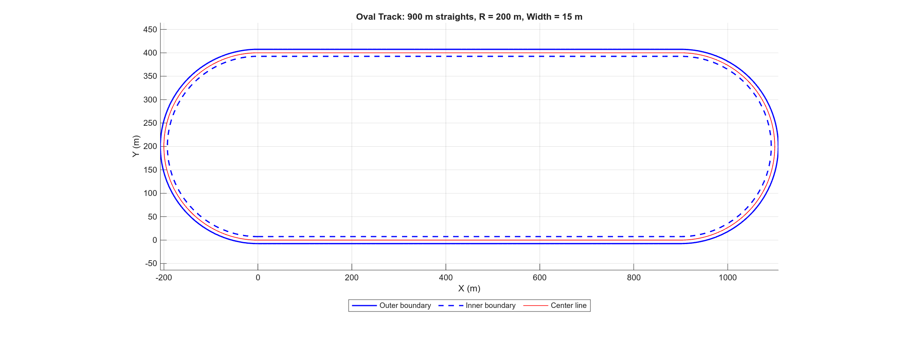
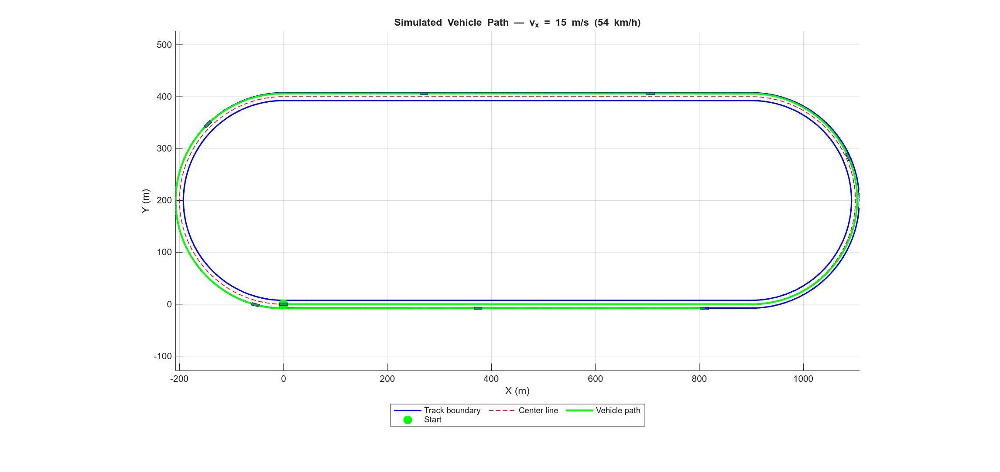
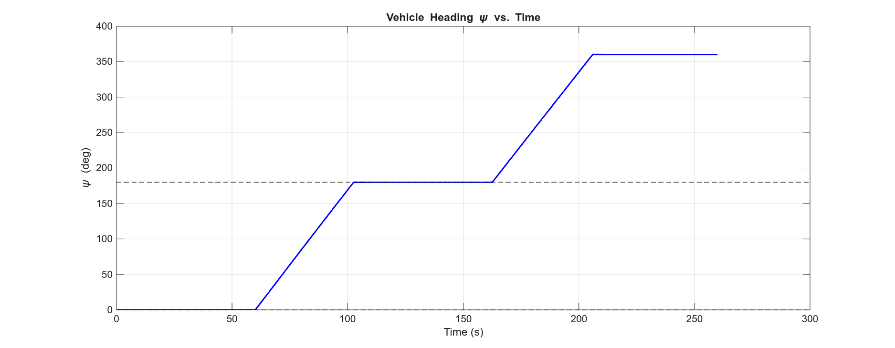
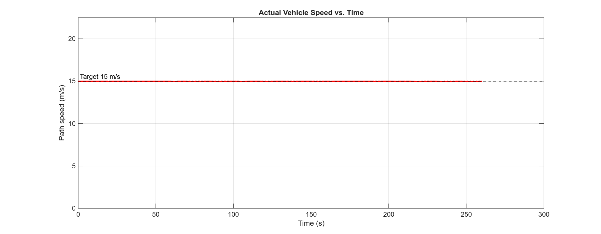

# Project 2 — Lateral Vehicle Model

## Team 4
Dalys Guajardo, Juan Lopez, Ian Wilhite

## Summary

This project builds a lateral dynamic vehicle model in Simulink to drive around an oval race track (two 900 m straights, two 200 m radius semicircles, 15 m width) as fast as possible without leaving the track boundaries.

**Week 1** established the track geometry and animation. `gentrack.m` generates a continuous oval using an incremental rotation loop starting and ending at (0, 0). The Simulink model (`Project_2_Kinematic_Model.slx`) contains the skeleton subsystems wired together, and `animate.m` runs the simulation and draws an animated 15 m × 5 m rectangular patch following the vehicle heading.

**Week 2** completes the closed-loop lateral dynamics model. The Simulink model contains four subsystems connected in a feedback loop:

1. **Driver Model** — a MATLAB Function (`SimplestDriver`) that takes vehicle position (X, Y), heading (ψ), and yaw rate (ω) and computes the front steering angle δ_f using a PD controller with Ackermann feedforward. The reference heading is determined from track geometry: curvature 1/R for both semicircles (both are counterclockwise) and ψ_ref = 0 (east) or π (west) for the two straights. Gains Kp = 0.5 and Kd = 2.0 were selected to provide heading correction without oscillation.

2. **Lateral Dynamics** — tire slip angles feed a linear cornering-stiffness model (C_α = 40 000 N/rad, F_max = 2 793 N) to produce lateral tire forces, which drive Newton–Euler equations for lateral velocity (v_y) and yaw rate (ω).

3. **Transformation/Rotation** — integrates the body-frame velocities rotated by heading angle ψ to produce world-frame X, Y coordinates.

4. **XY Graph** — plots the vehicle path in real time.

X, Y, and ψ are fed back to the Driver Model to close the loop. The target speed was set to **15 m/s (54 km/h)**. Maximum lateral acceleration with these tire parameters is 5.6 m/s², giving a curve speed limit of √(5.6 × 200) ≈ 33 m/s; 15 m/s provides a large margin and the vehicle stays within track boundaries for the full lap.

## Results

### Lap Statistics

| Metric | Value |
|---|---|
| Target speed | 15 m/s (54 km/h) |
| Laps completed | 1 |
| Lap time | 206.0 s |
| Total distance traveled | 3 900 m |
| Average speed | 15.00 m/s |
| Off-track events | 0 — car stayed within boundaries |

The vehicle completed one full lap (3 057 m center-line length) in **206 seconds** at a constant 15 m/s. The additional ~843 m beyond the center-line length reflects the slightly outer path taken through the two curves. No off-track violations were recorded.

---

### Track Layout

---

### Simulated Vehicle Path
The green line shows the simulated vehicle path over one full lap. Blue rectangles show vehicle pose at eight evenly-spaced time steps. The path stays within the track boundaries (blue) on all four sections.

---

### Vehicle Heading vs. Time
Heading increases from 0° (east) to 180° (west) through the right curve (~t = 60–105 s), holds at 180° along the top straight (~t = 105–165 s), then increases to 360° through the left curve (~t = 165–210 s), confirming correct traversal of all four track sections.

---

### Actual Speed vs. Time
Longitudinal speed is held constant at the target 15 m/s by the driver model. Lateral dynamics (tire slip, yaw) do not affect the commanded forward speed in this Week 2 model.

## How to Run
1. Open MATLAB, `cd` into `Project2/`.
2. Run `run.m` — this calls `init`, `gentrack`, then `animate` (launches Simulink and animates).
3. Lap statistics (loops completed, lap times, track violations) are printed to the console at the end.
4. To regenerate figures: type `gen_figs_week2` from the `Project2/` directory.

## Key Files
- `init.m` — vehicle parameters, tire data, target speed (`vxd = 15 m/s`), carData bus
- `gentrack.m` — track waypoint generation
- `Project_2_Kinematic_Model.slx` — Simulink model with Driver, Lateral Dynamics, Transformation, and XY Graph subsystems
- `animate.m` — runs Simulink and animates the vehicle patch
- `raceStat.m` — computes lap count, lap times, and off-track events
- `run.m` — top-level entry point
- `gen_figs_week2.m` — headless figure generation script
