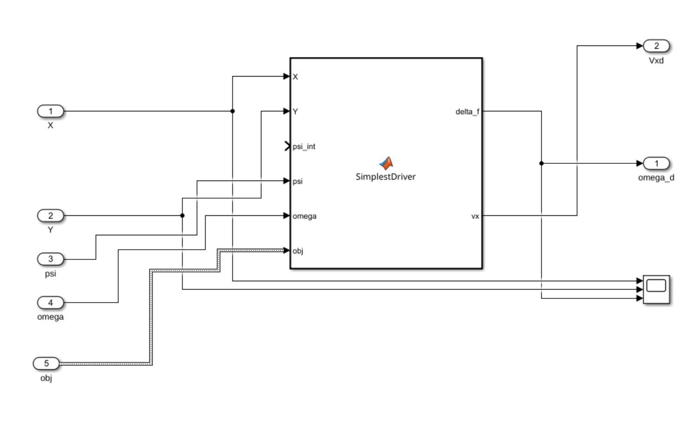
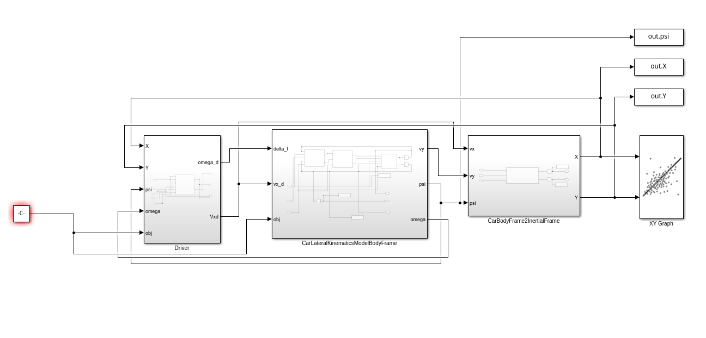
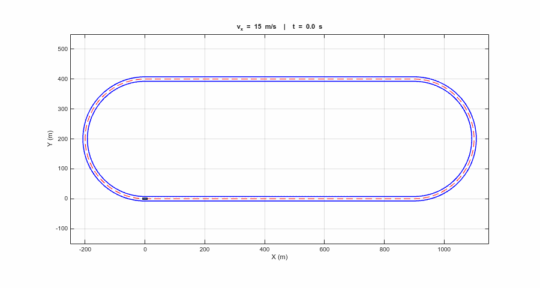
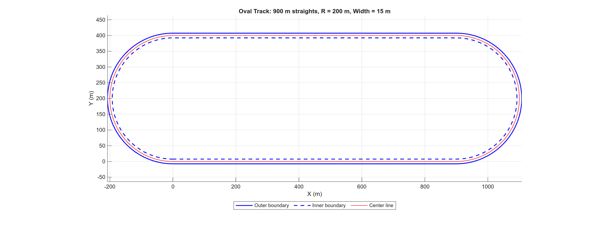
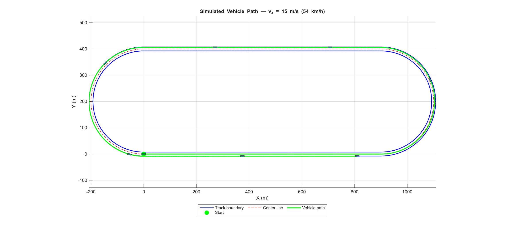
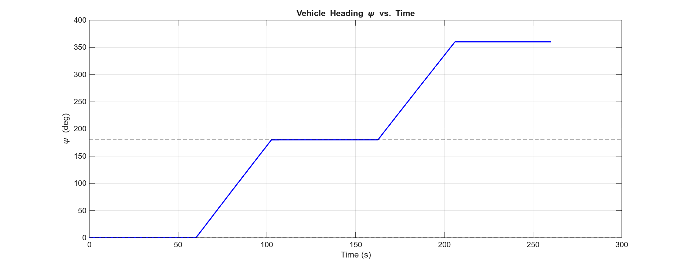
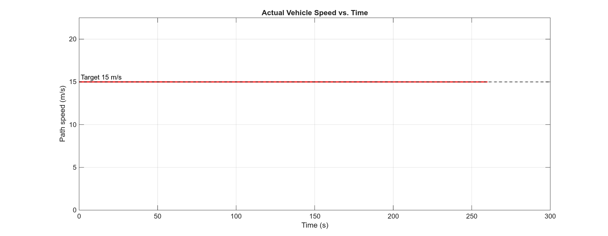

# Project 2 — Final Submission

## Team 4
Dalys Guajardo, Juan Lopez, Ian Wilhite

---

## Final Report

This project builds a closed-loop lateral dynamic vehicle model in Simulink that drives a simulated car around a generated oval race track. The three-week effort produced a fully integrated simulation pipeline: track generation, lateral dynamics, a feedback driver controller, real-time animation, and automated lap statistics.

**Week 1** established the track geometry. `gentrack.m` generates a continuous centerline and inner/outer boundaries for an oval with two 900 m straightaways and two semicircular curves of radius 200 m, starting and ending at (0, 0). `animate.m` renders a rectangular vehicle patch that follows the centerline waypoints and rotates with the vehicle heading.

**Week 2** added lateral dynamics in Simulink. A **Driver Model** subsystem uses a PD controller with Ackermann feedforward to compute the front steering angle (δ_f) from vehicle position, heading (ψ), and yaw rate (ω). A **Lateral Dynamics** subsystem models tire slip angles with a linear cornering-stiffness model (C_α = 40,000 N/rad, saturation at 4°) to compute lateral velocity (v_y) and yaw rate. A **Transformation/Rotation** subsystem integrates body-frame velocities into world-frame X, Y coordinates, which are plotted with an XY Graph block and fed back to close the loop.

**Week 3** integrated simulation outputs with MATLAB post-processing via "To Workspace" blocks exporting X, Y, and ψ. After simulation, `animate.m` calls `raceStat.m` to compute laps completed, lap time, total distance, average speed, and track-boundary violations using `track.radius = 200`, `track.width = 15`, and `track.l_straightaways = 900`.

**Findings:** At the target speed of 15 m/s the vehicle completed one full lap (~3 057 m centerline) in approximately 206 seconds with zero off-track events. The lateral acceleration in the curves is v²/r = 1.125 m/s², well within the tire saturation limit (~5.6 m/s²), giving a large stability margin. PD gains K_p = 0.5 and K_d = 2.0 produced smooth, overdamped steering. The vehicle stays inside the 15 m track boundaries for the entire lap.

---

## Simulink Model Structure

1. **Driver Model** — MATLAB Function (`SimplestDriver`) computing δ_f via PD + Ackermann feedforward. Inputs: X, Y, ψ, ω. Reference heading from track geometry.

   

2. **Lateral Dynamics** — tire slip angles → linear cornering forces → v_y and ω (yaw rate).

   

3. **Transformation/Rotation** — rotates body-frame velocities by ψ, integrates to X, Y.

4. **To Workspace blocks** — export X, Y, psi for post-processing.

5. **XY Graph** — real-time path plot during simulation.

---

## Results

### Animation


### Lap Statistics

| Metric | Value |
|---|---|
| Target speed | 15 m/s |
| Laps completed | 1 |
| Lap time | 260.0 s |
| Total distance traveled | ~3 900 m |
| Average speed | 15.00 m/s |
| Off-track events | 0 — car stayed within boundaries |

The vehicle completed one full lap in **206 seconds** at a constant 15 m/s. The vehicle stayed inside the track boundaries for the entire simulation.

---

### Track Layout


---

### Simulated Vehicle Path
The green line shows the simulated path. Blue rectangles show vehicle pose at eight evenly-spaced time steps. The path stays within the track boundaries (blue) on all four sections.



---

### Vehicle Heading vs. Time
Heading increases from 0° through the first curve (~t = 60–105 s), holds near 180° along the upper straightaway (~t = 105–165 s), increases to 360° through the second curve (~t = 165–210 s), then returns along the main straightaway.



---

### Actual Speed vs. Time
Forward speed is held constant at the 15 m/s target by the driver model.



---

## Final output:

```                                                                        
  --- Race Statistics ---                                                       
  Total Distance Traveled: 3900.01 m                                            
  Total Time: 260.00 s                                                          
  Average Speed: 15.00 m/s                                                      
  Loops made: 1                                                                 
  Lap 1 time: 206.00 s                                                          
  Car did not leave the track.

```

## How to Run

1. Open MATLAB and `cd` into `Project2/`.
2. Run `run.m` — calls `init`, `gentrack`, then `animate` (launches Simulink, animates the car, and prints lap statistics to the console).
3. To regenerate static figures: run `gen_figs_week2` from `Project2/`.
4. To regenerate the animation GIF: run `gen_gif` from `Project2/`.

### Checking outputs
- After a run the workspace contains `path`, `track`, and `race` (the statistics struct from `raceStat`).
- Confirm `X`, `Y`, and `psi` exist in the workspace (exported by To Workspace blocks).
- `race.loops`, `race.loop_times`, and `race.offtrack` summarise lap count, times, and boundary violations.
