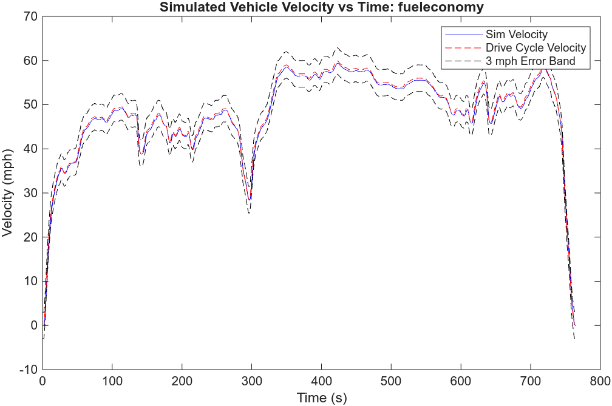
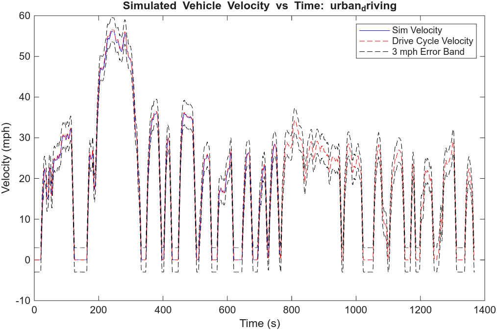

# Project 3 – Week 1

## Summary:

A longitudinal vehicle dynamics model with a simple driver was built in Simulink to follow EPA drive cycles while staying inside a ±3 mph error band. The model has three key parts: 
1) Drive Schedule converts EPA cycle data (mph to m/s)
2) Throttle/Brake Logic compares desired vs. actual speed and commands APP or BPP
3) Longitudinal Dynamics computes motion from drive force, brake force, and aerodynamic/rolling drag.

## Run steps:

1) `p3_init.m` to load vehicle parameters.
2) Select a cycle: `urbandrivinginit.m` (urban) or `fueleconomyinit.m` (highway). Each script defines `DriveData`, `Time`, and `cycleName`.
3) `p3_runsim.m` runs the Simulink model, prints the maximum absolute speed error, and saves `Plots/<cycleName>_plot.pdf` with the drive-cycle overlay and ±3 mph band.

Both urban and highway simulations hold max error below 3 mph when using the provided controller gains and vehicle parameters.

## Figures:
Highway velocity vs time:

Urban velocity vs time:
