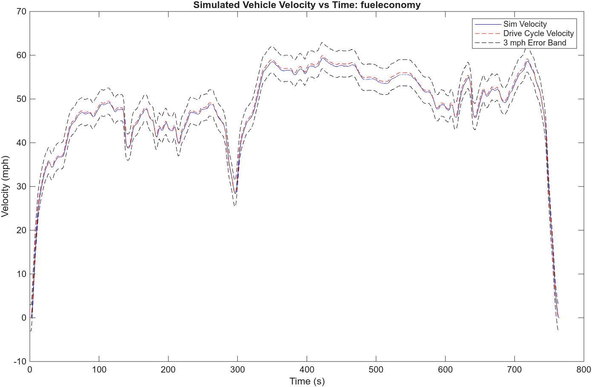
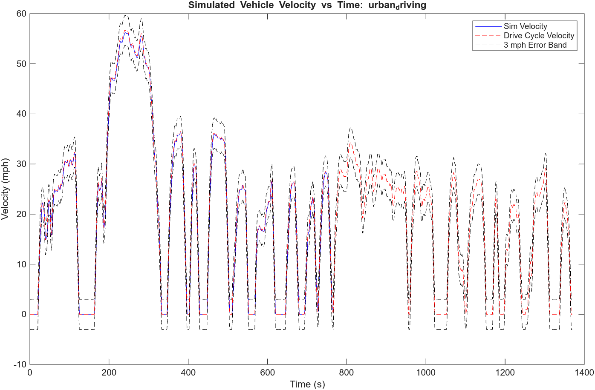

# Project 3 – Week 2

## Summary:

The Week 1 longitudinal vehicle model was extended by incorporating an electric vehicle (EV) powertrain with a single-speed transmission and motor energy analysis. The model continues to track EPA drive cycles within a ±3 mph error band while now also estimating energy consumption.

The updated model consists of three primary subsystems:

- **Drive Schedule** Converts EPA drive cycle data from mph to m/s and outputs desired vehicle speed.

- **Throttle and Braking Logic** Compares desired and actual speed to generate accelerator pedal position (APP) and brake pedal position (BPP).

- **Longitudinal Dynamics Body Frame (Updated)** Computes vehicle acceleration based on:

  - Drive force from motor torque
  - Braking force
  - Aerodynamic and rolling resistance

Additionally, this subsystem now models the EV powertrain by:

- Converting vehicle speed to motor speed using a fixed gear ratio
- Estimating motor torque from driver input
- Computing motor mechanical and electrical power
- Logging motor power for energy calculations

---

## EV Powertrain Modeling:

A simplified EV powertrain model is used with the following assumptions:

- Single-speed transmission with fixed gear ratio
- Constant drivetrain efficiency
- No regenerative braking (energy during braking is not recovered)

Motor power is computed as:

- Mechanical power:

``` P_{mech} = T_{motor} cdot omega_{motor} ```

- Electrical power (traction only):

``` P_{elec} = frac{P_{mech}}{eta} ), when ( P_{mech} > 0 ```

Energy consumption is calculated by integrating positive electrical power over time.

---

## Run Instructions:

1. Initialize vehicle parameters:

```matlab
p3_init
```

2. Select a drive cycle:

```matlab
urbandrivinginit    % Urban Cycle
fueleconomyinit     % Highway Cycle
```

3. Run simulation:

```matlab
p3_runsim
```

The script will:

 - Simulate p3_car.slx
 - Plot simulated vs. desired velocity
 - Verify ±3 mph tracking requirement
 - Compute and display total energy consumption (kWh)
 - Save velocity plots in assets/

## Results:

**Highway Cycle:**

Max speed error: ≤ 3 mph (2.30 mph)

Energy consumed: 1.7228 kWh



**Urban Cycle:**

Max speed error: ≤ 3 mph (2.45 mph)

Energy consumed: 0.8818 kWh



## Observations:

The vehicle successfully tracks both drive cycles within the required ±3 mph error band.

Highway driving consumes more total energy (1.7228 kWh) than urban driving (0.8818 kWh) due to higher sustained speeds requiring greater continuous motor output.

Urban driving consumes less total energy despite frequent stop-and-go, because overall vehicle speeds are lower.

Since regenerative braking is not included, all braking energy is lost as heat, which particularly penalizes the urban cycle where braking events are frequent.
