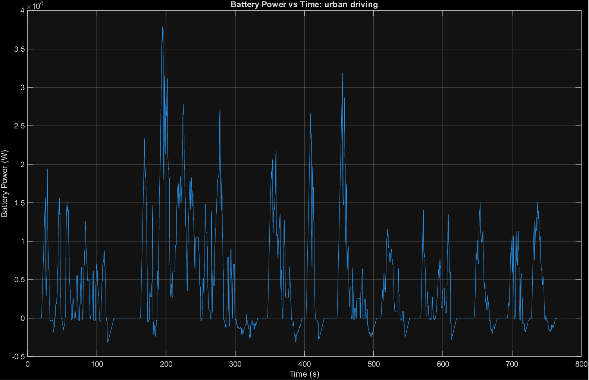
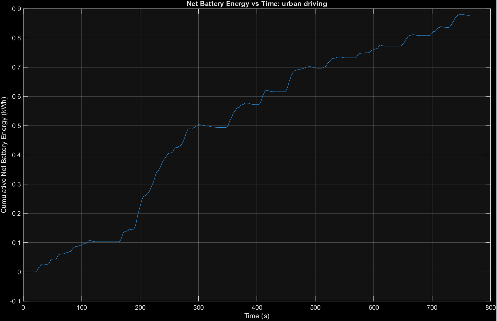
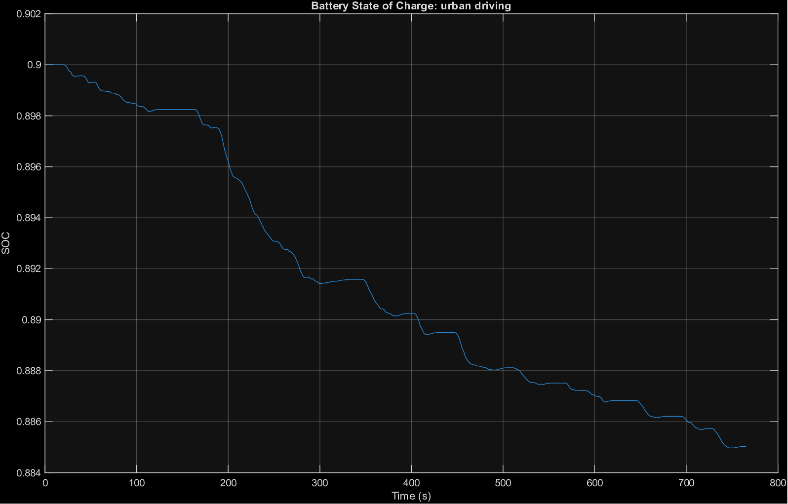
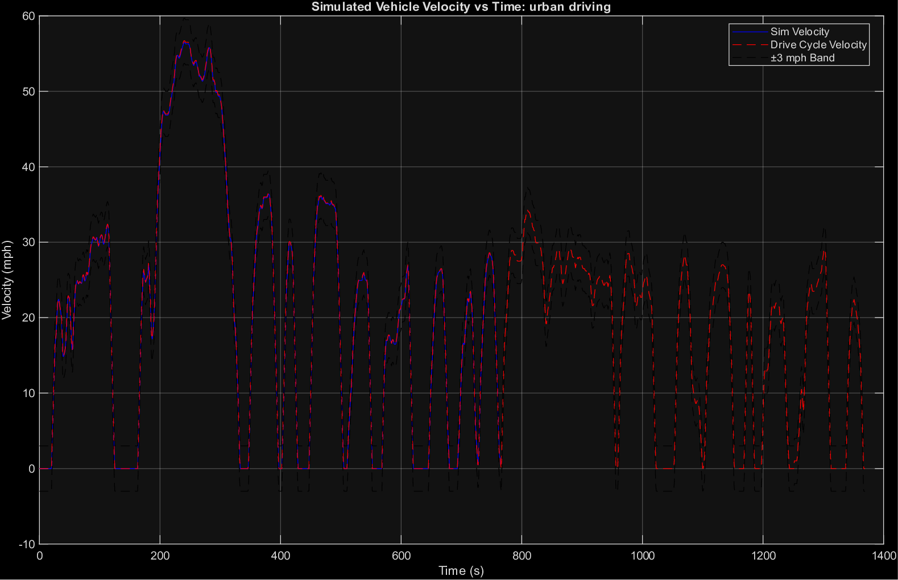
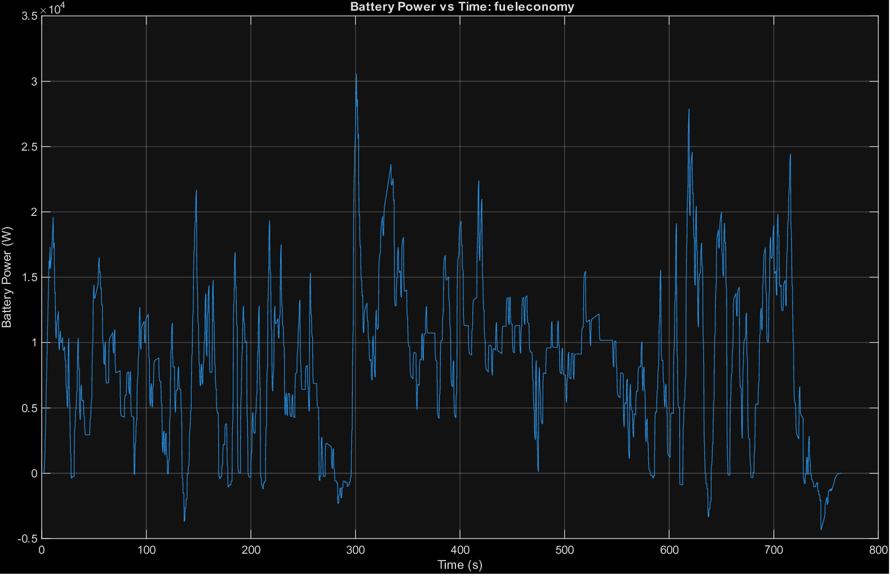
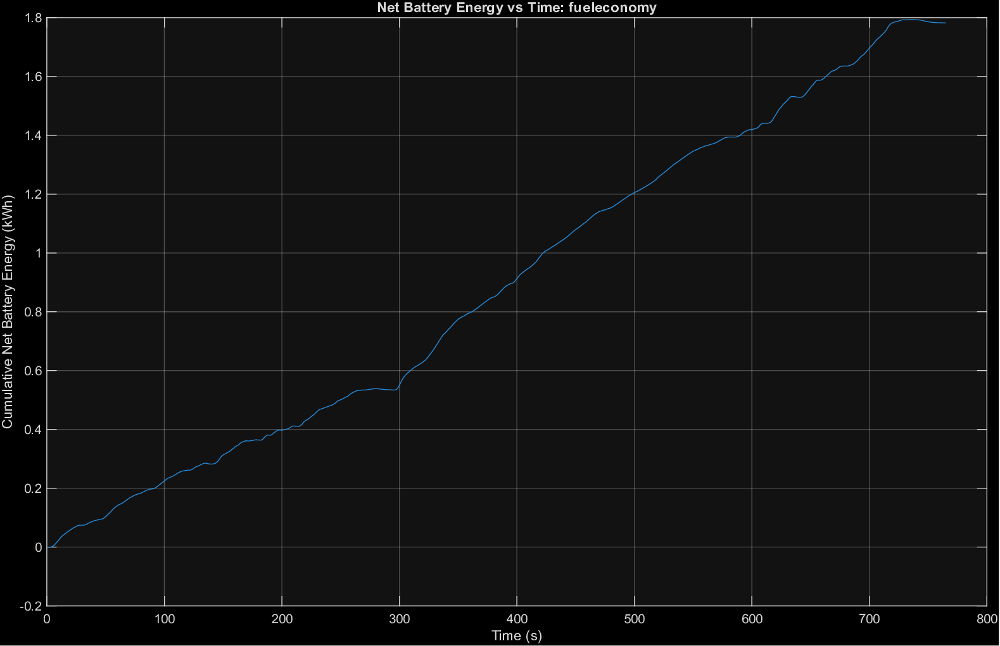
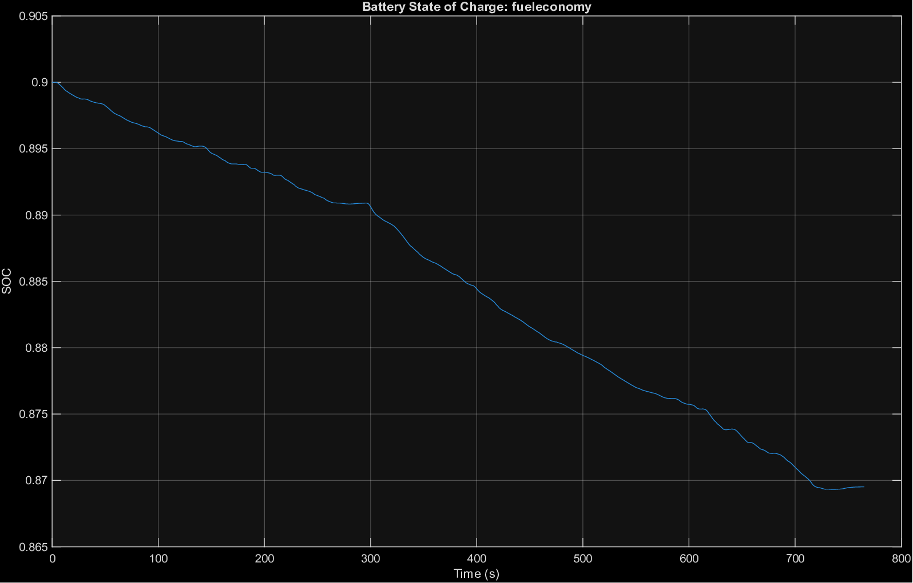
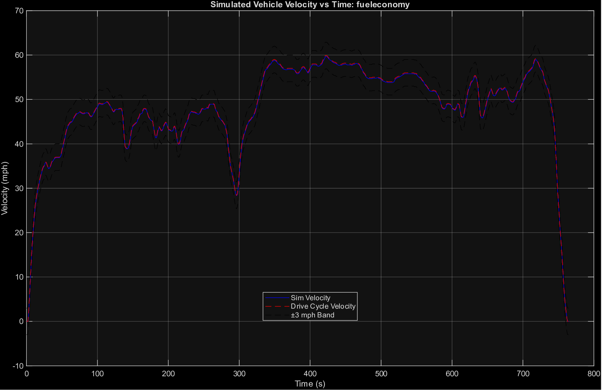

# Project 3 – Week 3

## Summary:

The longitudinal vehicle model was extended to include a battery model and regenerative braking while maintaining ±3 mph tracking of EPA drive cycles. The system includes a Drive Schedule, Throttle/Braking Logic, and an updated Longitudinal Dynamics subsystem that computes vehicle motion, motor behavior, battery power, and state of charge (SOC).


Battery power is calculated from motor mechanical power, with positive values representing energy consumption and negative values representing regenerative braking. Energy usage is obtained by integrating battery power, while SOC is updated dynamically based on battery current.

## Run Instructions:

```matlab

p3_init

urbandrivinginit      % or fueleconomyinit

p3_runsim

```

The script simulates `p3_car.slx`, verifies ±3 mph tracking, computes energy metrics, and generates four plots saved to `Week3Plots_Fuel_Economy/` or `Week3Plots_Urban_Driving/`:

- **Battery Power vs Time** – instantaneous battery power (positive = draw, negative = regen)
- **Net Battery Energy vs Time** – cumulative net energy from battery over the cycle
- **Battery State of Charge** – SOC evolution throughout the drive cycle *(new this week)*
- **Simulated Vehicle Velocity vs Time** – simulated vs. drive cycle reference with ±3 mph band

## Results:

**Urban Cycle:**

Max error: 0.77 mph

Energy used: 0.9300 kWh

Regen recovered: 0.0527 kWh

Net energy: 0.8773 kWh

SOC drop: 1.50%


**Fuel Economy Cycle:**

Max error: 0.72 mph

Energy used: 1.8080 kWh

Regen recovered: 0.0254 kWh

Net energy: 1.7826 kWh

SOC drop: 3.05%


## Figures:

**Urban Cycle:**






**Fuel Economy Cycle:**







## Observations:


Both cycles meet the tracking requirement. The urban cycle shows frequent power fluctuations and higher regenerative recovery due to repeated braking. The fuel economy cycle exhibits smoother power demand but higher overall energy consumption.


The higher energy usage in the fuel economy cycle is attributed to sustained higher speeds, where aerodynamic drag increases power demand significantly. In contrast, the urban cycle benefits from regenerative braking, reducing net energy consumption.


## Conclusion:


The updated model successfully captures EV energy behavior, including regenerative effects and SOC dynamics. Results demonstrate how driving conditions influence efficiency, with urban driving benefiting from energy recovery and fuel economy driving dominated by continuous power demand.


