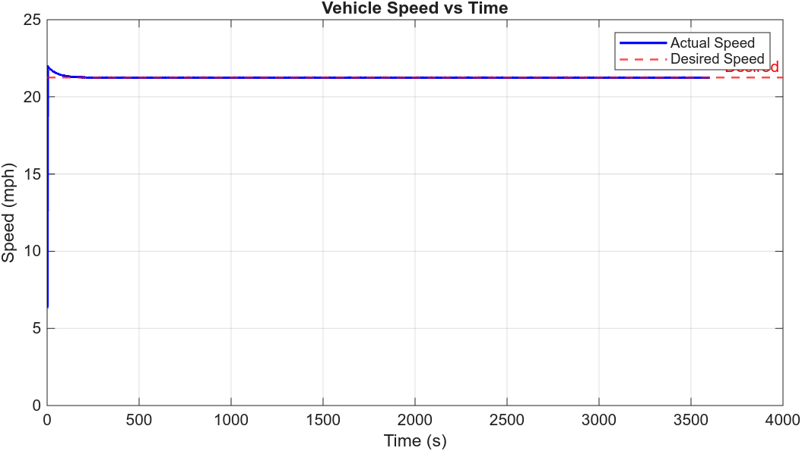

# Project 4 (Team) – Week 1


In P4 we combined lateral and longitudial dynamics onto a powertrain into a single vehicle model. 

---

## Run Instructions

```matlab
% Full pipeline (simulation + figures):
p4_init        % initialize vehicle, battery, motor parameters and generate track
p4_runsim      % run p4_model.slx, save figures/simdata.mat
gen_all_figs   % load simdata.mat and generate all figures + animation GIF
```

Or use the bash helper (from the `Week1/` directory):

```bash
./run_p4.sh          # full pipeline: sim then figures
./run_p4.sh --figs   # figures only (skips sim, loads existing simdata.mat)
```

### Key Scripts

| Script | Purpose |
|--------|---------|
| `p4_init.m` | Loads vehicle/battery/motor parameters, generates track, sets sim stop time |
| `p4_runsim.m` | Runs `p4_model.slx`, extracts signals, saves `figures/simdata.mat` |
| `gen_all_figs.m` | Loads saved data, generates all figures and animation GIF |
| `gentrack.m` | Builds oval track path struct (900 m straights, R = 200 m semicircles) |
| `friction.m` | Enforces friction braking percentage requirement vs. vehicle speed |
| `run_p4.sh` | Bash helper to run sim and/or figures in sequence |

---

## Results

| Parameter | Value |
|-----------|-------|
| Simulation time | 3600 s (60 min) |
| Target speed | 25 mph (11.176 m/s) |
| Laps completed | 12.91 |
| Track length | 3057 m/lap |
| Initial SOC | 80.0% |
| Final SOC | ~77.7% |
| SOC drop | ~2.3% |

---

## Figures

### Fig 1 — Lap 1 Trajectory


### Fig 2 — Full Run Trajectory (All Laps, coloured by time)


### Fig 3 — Vehicle Speed vs Time (Full Run)



### Fig 3b — Vehicle Speed vs Time (First 250 s)


### Fig 4 — Battery SOC vs Time


### Fig 5 — Lateral Position vs Lap Position (Cross-Track Error)


### Animation


---

## Observations

- Speed tracking: vehicle reaches full speed quickly and transient is visible in Fig 3b (first ~30 s)
- Track boundary: lateral offsets (Fig 5) show the vehicle stays within the ±7.5 m track half-width.
