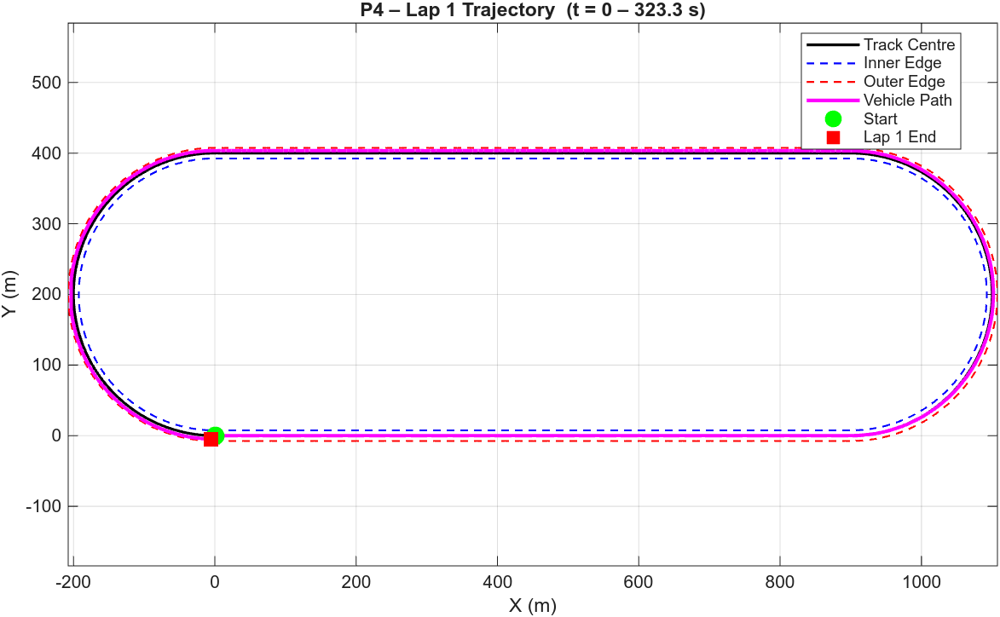
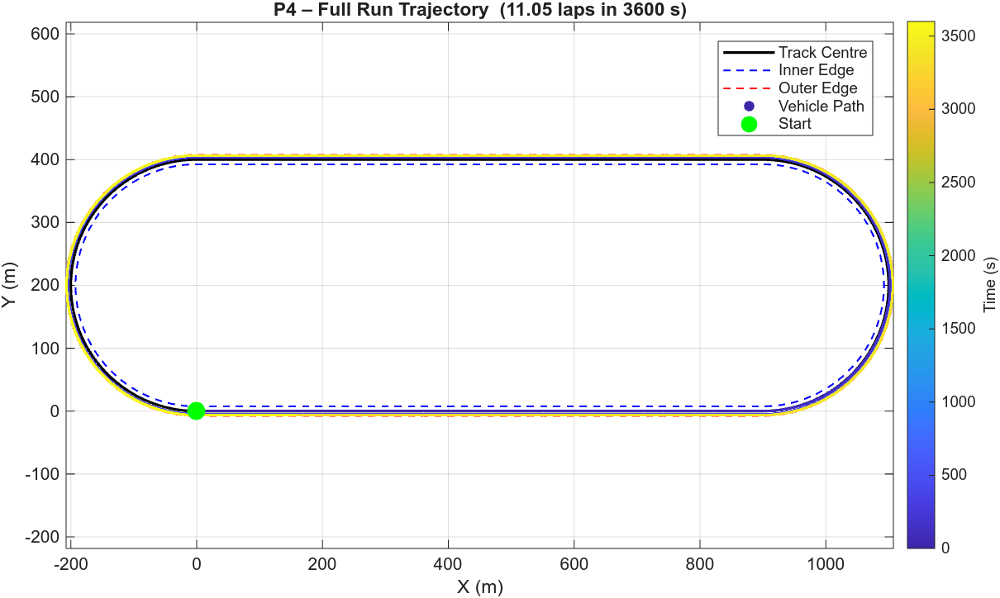
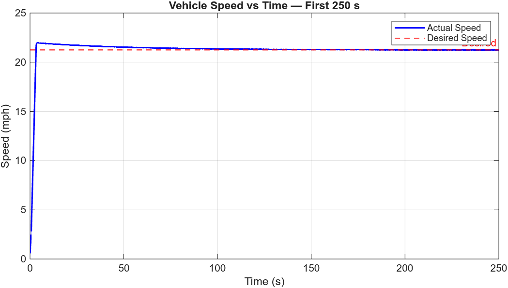
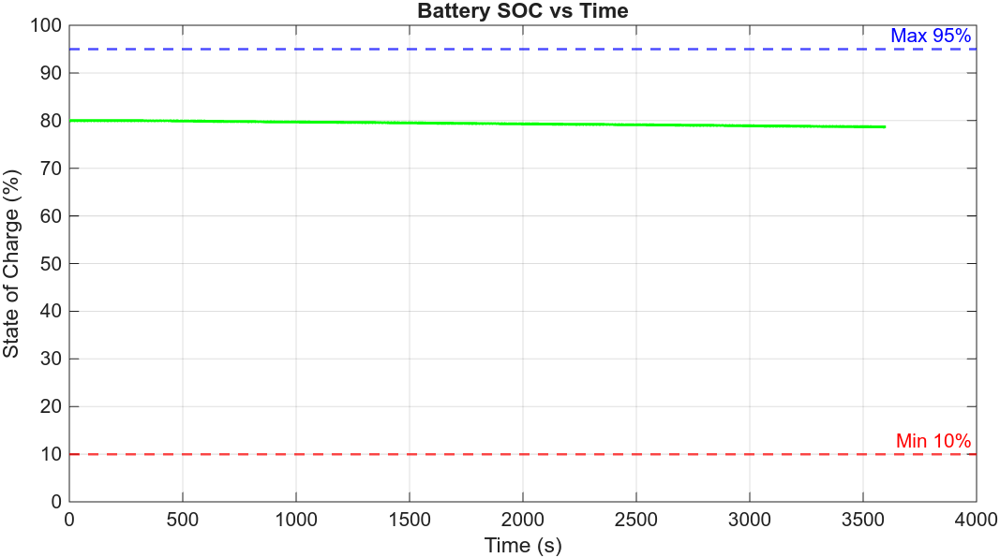
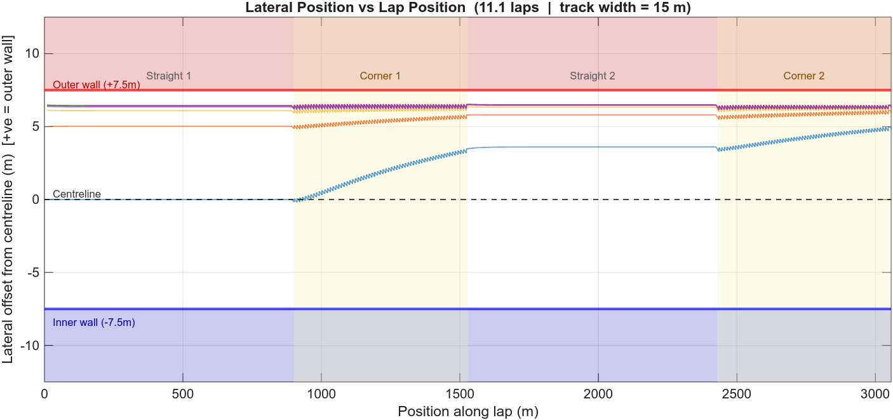
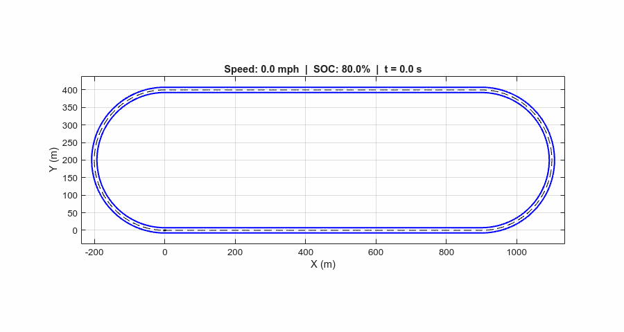
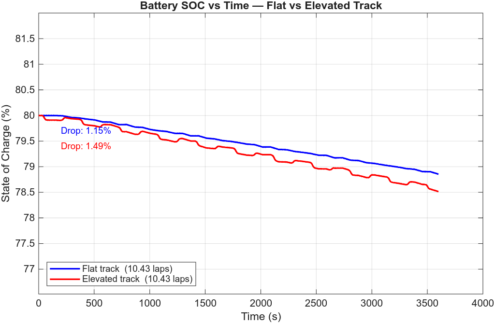
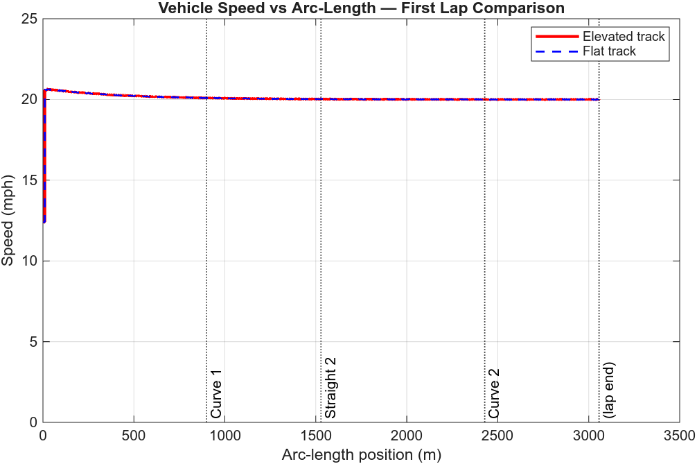

# Project 4 (Individual) – Week 1 Progress

<!-- CLAUDE NOTES — human authorship recommended for this section
Suggested talking points:
- Context: individual extension of the team P4 model
- The track is no longer flat; elevation adds gravitational load on the longitudinal dynamics
- Goal: maximize laps in 60 min while staying within the ±7.5 m track boundary
- Assumption stated in the spec: no loss of road contact on the slopes
-->

---

## Problem Statement

The race track now includes a vertical elevation profile on both straight segments.
The start straight rises from 0 m to 10 m following a smooth sigmoidal curve; the return straight
descends from 10 m back to 0 m using the same curve shape:

```
Height(x) = exp((x - 450)/50) / (1 + exp((x - 450)/50)) * 10   [meters]
```

The objective is to modify the current EV model to account for elevation, then find a speed strategy that maximizes distance traveled in a 60-minute simulation.

---

## Run Instructions

```matlab
% Full pipeline:
p4_init        % initialize parameters and generate track
p4_runsim      % run simulation and generate plots
```

### Key Scripts

| Script               | Purpose                                                                        |
| -------------------- | ------------------------------------------------------------------------------ |
| `p4_init.m`          | Initializes vehicle, battery, and motor parameters; sets simulation conditions |
| `p4_runsim.m`        | Runs simulation, computes performance metrics, generates plots                 |
| `gentrack.m`         | Generates oval track geometry (x–y path, inner/outer bounds)                  |
| `friction.m`         | Enforces braking friction constraints                                          |
| `VehicleInit.m`      | Vehicle physical parameters (mass, tire stiffness, geometry)                   |
| `BatteryInit.m`      | Battery pack parameters and initial SOC                                        |
| `ElectricMotorInit.m`| Motor torque/speed map and gearbox ratios                                      |
| `compute_elevation.m`| Returns height, grade angle, and grade force for a given track x-position      |

---

## Model Modifications for Elevation

### Height Profile

The elevation is computed from the longitudinal arc-length position `s` along the start straight
(x ∈ [0, 900] m) and the return straight (x ∈ [900, 0] m, traversed in reverse):

The height and grade angle at each path point are computed in `gentrack.m` and stored in the
`path` struct:

```matlab
sig  = exp((x - 450)/50) / (1 + exp((x - 450)/50));
dhdx = (10/50) * sig * (1 - sig);          % dH/dx

path.hpath(i)       = sig * 10;            % height (m)
path.grade(i)       = ±dhdx;              % signed along direction of travel
path.theta_grade(i) = atan(path.grade(i)); % grade angle (rad)
```

Sign convention: positive grade = uphill in the direction of travel (start straight), negative =
downhill (return straight). Curved sections are assumed flat at constant height.

A cumulative arc-length array `path.cumS` is also computed and stored for lookup-table use.

The standalone helper `compute_elevation(x, direction, mass)` returns height, grade angle, and
grade force at any x-position.

### Longitudinal Dynamics Update

On a grade, the gravitational component modifies the net longitudinal force:

```
m * a = F_traction - F_drag - F_roll - m * g * sin(theta_grade)
```

- **Uphill (start straight):** `sin(theta) > 0` — additional resistive load, increases motor demand
- **Downhill (return straight):** `sin(theta) < 0` — gravity assists, reduces demand and provides
  additional regenerative braking opportunity

At peak grade (x = 450 m, midpoint of each straight), theta ≈ 2.86° and grade force ≈ 784 N
(~5% of vehicle weight). This is modest but non-negligible at the battery/lap-count margin.

A 1-D lookup table `grade_lut` (arc-length → theta_grade) is prepared in `p4_init.m` for direct
use by a Simulink Lookup Table block in the longitudinal force subsystem.

> **Week 1 status:** Elevation geometry, grade angles, arc-length lookup table, and grade force
> computation are fully implemented. The Simulink longitudinal block requires one additional
> grade-force input using this lookup table — targeted for Week 2.

---

## Baseline Results (Flat Track – Pre-Elevation)

The results below are from the validated flat-track model (team Week 2 submission) and serve as the
performance baseline before elevation is applied.

| Parameter             | Value                              |
| --------------------- | ---------------------------------- |
| Simulation time       | 3600 s (60 min)                    |
| Target speed          | 20 mph (8.94 m/s)                  |
| Lookahead distance    | 7 m                                |
| Gearbox               | 3-speed (ratios: 10.0 / 3.0 / 1.0)|
| Laps completed        | 10.43                              |
| Track length          | 3057 m/lap                         |
| Initial SOC           | 80.00 %                            |
| Final SOC             | 78.85 %                            |
| SOC drop              | 1.15 %                             |
| Max cross-track error | 7.27 m                             |
| Track limit           | ±7.50 m                            |
| Flat-track valid      | YES                                |

---

## Figures (Flat-Track Baseline)

### Fig 1 — Lap 1 Trajectory



### Fig 2 — Full Run Trajectory (All Laps, coloured by time)



### Fig 3 — Vehicle Speed vs Time (Full Run)


### Fig 3b — Vehicle Speed vs Time (First 250 s)



### Fig 4 — Battery SOC vs Time



### Fig 5 — Lateral Position vs Lap Position (Cross-Track Error)



### Animation



---

## Comparison Figures — Flat vs Elevated Track (Estimated)

> These figures are generated by post-processing the flat-track run to estimate the elevated-track
> SOC behaviour (`estimate_elevated.m`). The grade is mild (≤2.86°) so the speed controller
> maintains target speed on both tracks; the primary measurable effect is on battery SOC.
> Figures will be replaced with full Simulink results in Week 2.

### Fig C1 — Battery SOC vs Time



The elevated track (red) drains **1.49%** SOC over the 60-minute run vs **1.15%** on the flat
baseline — a **+0.34%** penalty from the grade round-trip efficiency loss (η_drive × η_regen ≈
0.72). The staircase pattern in the elevated curve shows each lap's uphill/downhill imbalance
accumulating.

<!-- 
### Fig C2 — Speed vs Arc-Length (First Lap)



Both runs maintain the 20 mph target throughout the lap. The near-perfect overlap confirms the
speed controller handles the mild grade (max 2.86°) without measurable speed deviation, and that
lap count will be unchanged. The main cost of the grade is energy, not speed. 
-->

---

## Week 1 Progress Summary

- [x] Flat-track combined model validated (baseline above)
- [x] Elevation formula and slope angle derivation reviewed
- [x] Height profile and signed grade angle computed for every path point (`gentrack.m`)
- [x] Cumulative arc-length lookup table built (`path.cumS`, `grade_lut` in `p4_init.m`)
- [x] Standalone helper `compute_elevation.m` implemented and verified
- [x] Elevation/grade profile figure added to `p4_runsim.m`
- [ ] Grade force term wired into Simulink longitudinal dynamics block
- [ ] Speed strategy re-tuned for elevated track
- [ ] Final performance results with elevation
