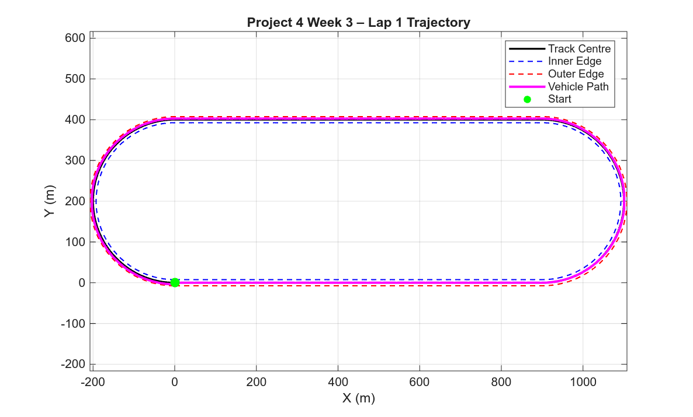
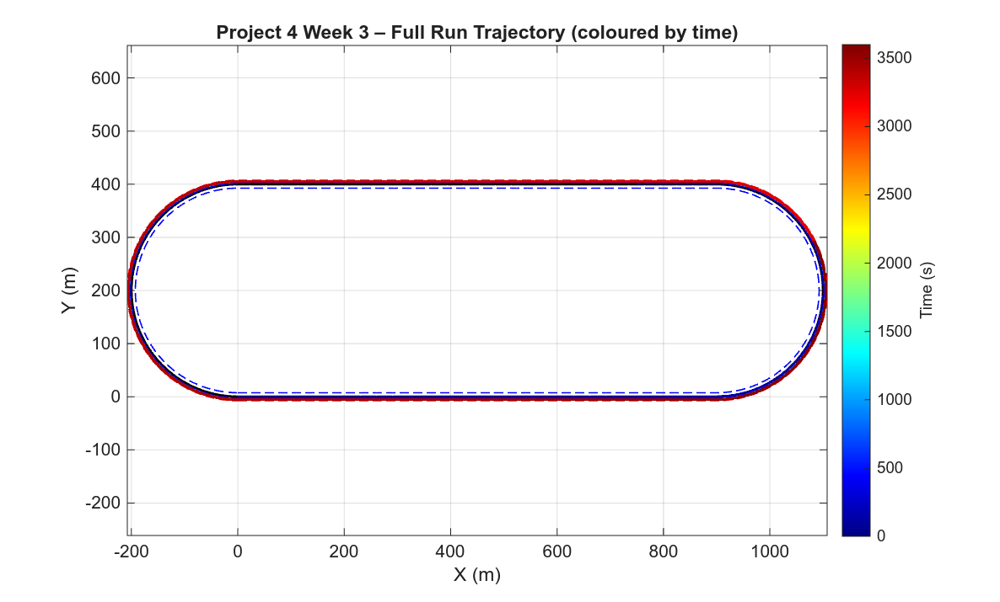
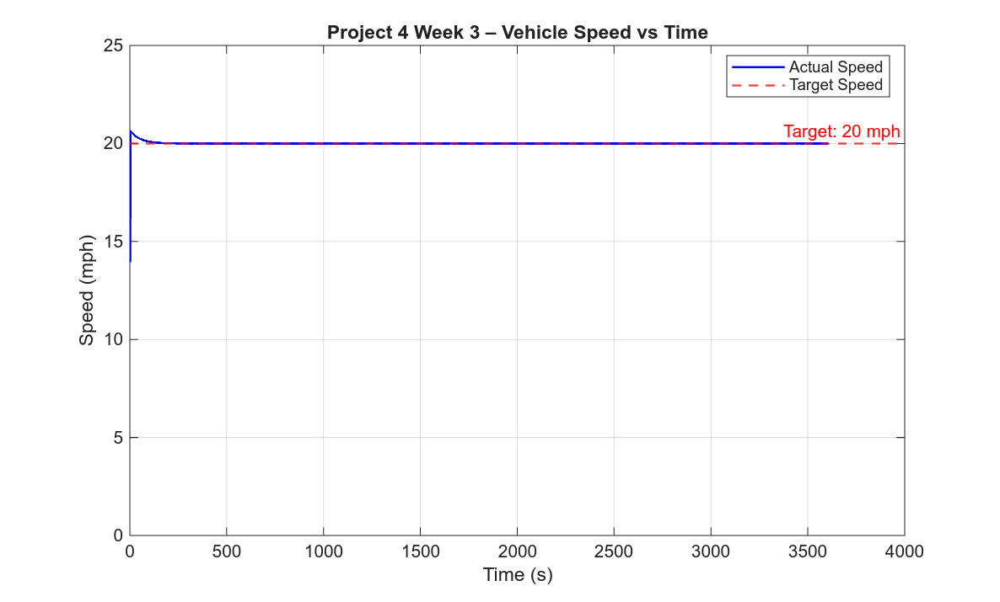
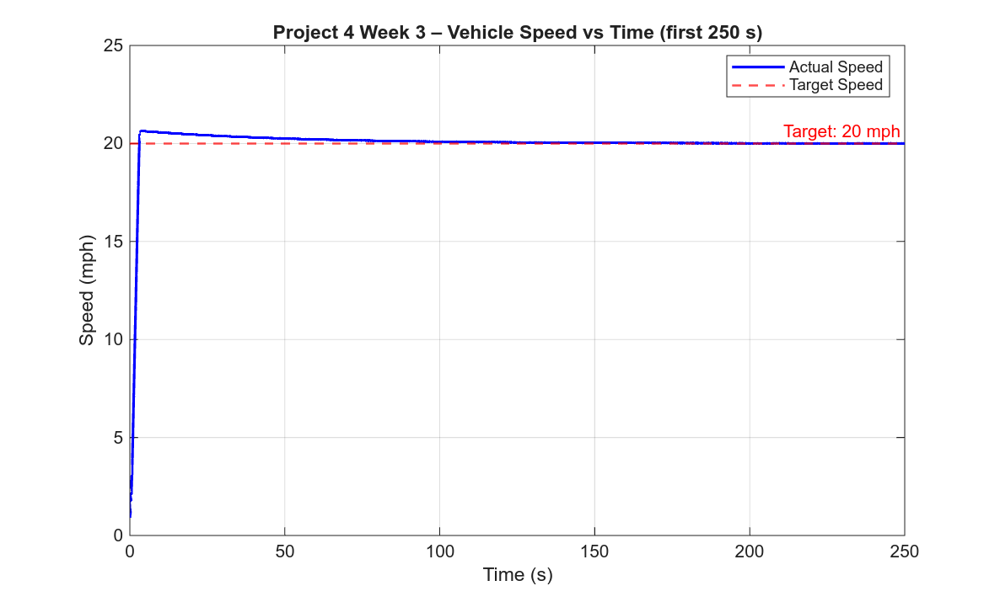
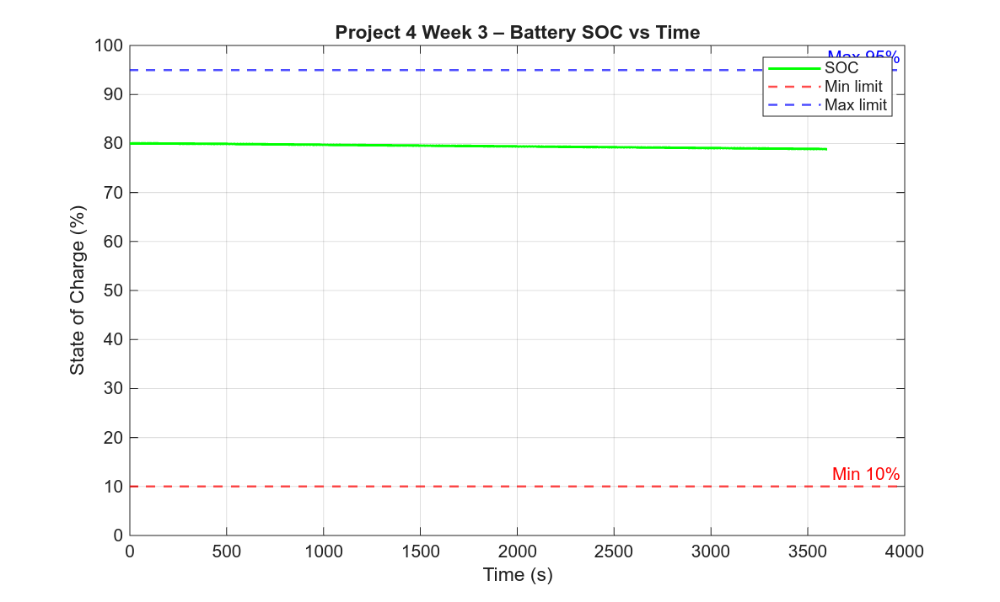
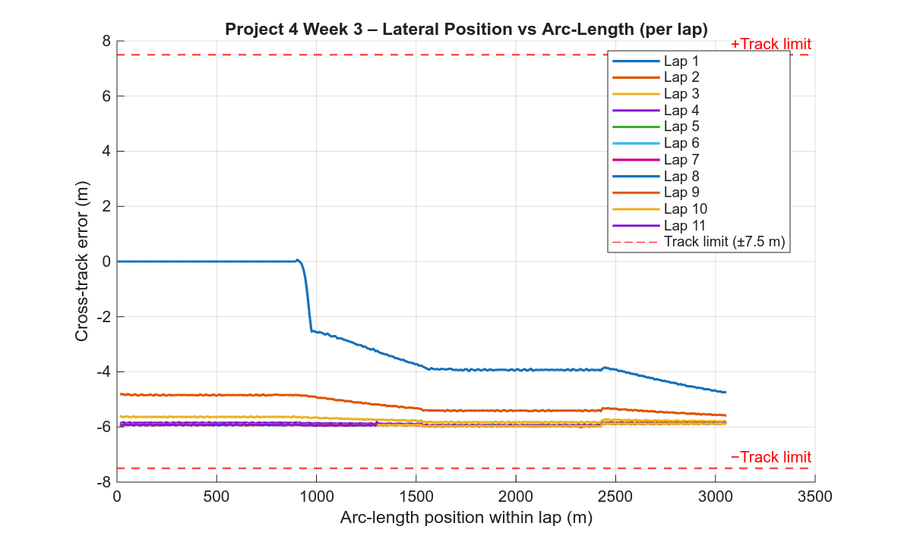

# Project 4 (Team) – Week 3

## Overview

In Project 4, we combined lateral and longitudinal dynamics with an electric powertrain model to simulate a vehicle completing laps around a track.

The objective for Week 3 was to maximize the number of laps completed in a 60-minute simulation while satisfying all project constraints, with the additional requirement of assuming a tire-road friction coefficient of μ = 0.5.

---

## Run Instructions

```matlab
% Full pipeline:
p4_init        % initialize parameters and generate track
p4_runsim      % run simulation and generate plots
```

### Key Scripts

| Script | Purpose |
|--------|---------|
| `p4_init.m` | Initializes vehicle, battery, and motor parameters; sets simulation conditions |
| `p4_runsim.m` | Runs simulation, computes performance metrics, generates plots |
| `p4_week3_tune.m` | Sweeps target speeds to find fastest valid solution under μ = 0.5 |
| `gentrack.m` | Generates oval track geometry |

---

## Results

| Parameter | Value |
|-----------|-------|
| Simulation time | 3600 s (60 min) |
| Target speed | 20 mph (8.94 m/s) |
| Lookahead distance | 7 m |
| Laps completed | 10.43 |
| Track length | 3057 m/lap |
| Initial SOC | 80.00% |
| Final SOC | 78.85% |
| SOC drop | 1.15% |
| Max cross-track error | 7.27 m |
| Track limit | ±7.50 m |
| Week 3 valid | YES |

---

## Figures

### Fig 1 — Lap 1 Trajectory



### Fig 2 — Full Run Trajectory (All Laps, coloured by time)



### Fig 3 — Vehicle Speed vs Time (Full Run)



### Fig 3b — Vehicle Speed vs Time (First 250 s)



### Fig 4 — Battery SOC vs Time



### Fig 5 — Lateral Position vs Arc-Length (Cross-Track Error per Lap)



---

## Observations

* The simulation was updated to use the required tire-road friction coefficient of μ = 0.5, reducing available lateral grip compared to Week 2.
* A speed sweep was performed to determine the fastest valid constant target speed under the new friction condition.
* The vehicle remained valid at 18–20 mph, while speeds ≥ 21 mph became invalid due to exceeding the track boundary.
* The optimal target speed was found to be 20 mph, resulting in 10.43 laps completed over the 3600 s simulation.
* The maximum cross-track error (7.27 m) remained within the allowable limit of ±7.5 m but operated close to the boundary, indicating limited lateral margin.
* Battery SOC decreased from approximately 80.00% to 78.85%, confirming that energy usage is not the limiting factor.
* The reduction in friction primarily impacted cornering performance, causing the vehicle to leave the track at higher speeds.

---

<!-- CLAUDE NOTES — human authorship recommended for this section
Suggested talking points:
- Week 3 model satisfies all constraints under μ = 0.5 friction
- 20 mph is the fastest valid constant-speed solution
- Lateral tracking performance is the primary constraint, not battery
- Future work: adaptive speed (slow in curves, fast on straights) to improve lap count
-->
